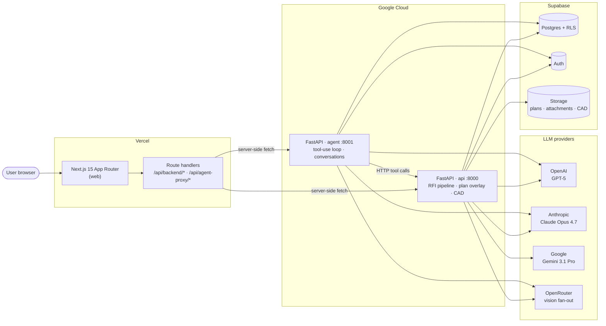
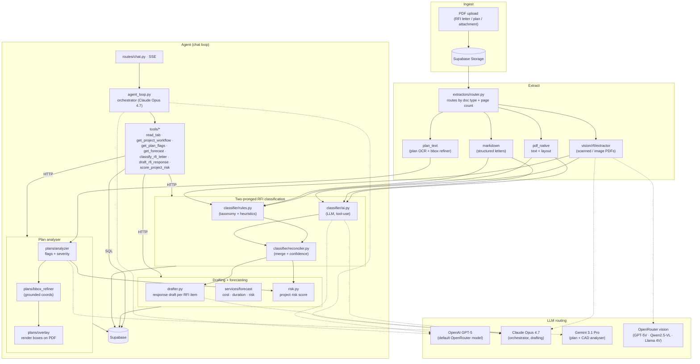

# Architecture

Two views: the **system** (services, storage, deploy targets) and the **AI pipeline** (how a document moves through extraction, classification, drafting, and the agent loop).

## System

Notes:

- The browser never talks to `api` or `agent` directly — Next.js route handlers proxy both, so only the web origin is public.
- `api` and `agent` are independent FastAPI services sharing the same Supabase project. `agent` calls `api` over HTTP for heavy tools (plan flags, forecast, classification).
- Local dev uses `docker compose up` from the repo root.

## AI pipeline

Highlights:

- **Two-pronged classifier**: deterministic rules and an LLM run in parallel; `reconciler` merges them with a confidence score, so a single provider blip can't silently corrupt a letter.
- **Plan grounding**: every flag the LLM raises is re-grounded to a bounding box on the source PDF before it's persisted, so the UI can render an overlay the user can verify.
- **Agent tools call `api`**: the agent doesn't re-implement classification or forecasting — it invokes the same FastAPI endpoints the web app uses, so behaviour stays consistent.
- **Model routing is per-role**, configured by env var (`anthropic_model`, `gemini_model`, `openrouter_model`, `cad_analyser_model`, `agent_orchestrator_model`, `agent_summarizer_model`) — providers swap without code changes.
