# The RFI Engine

Extensive engineering reference for the **RFI engine** — the subsystem that turns uploaded building documents into grounded compliance findings ("flags" = potential council Requests-For-Information), and that turns incoming council RFI letters into classified, drafted, exportable responses.

> Scope note. "RFI" is used in two senses in this codebase and both live under "the RFI engine":
> 1. **The flagger** (outbound): analyse plans / specs / CAD → produce grounded compliance flags that *predict* the RFIs a Building Consent Authority (BCA) would raise. This is the bulk of the engine.
> 2. **The letter pipeline** (inbound): a real council RFI letter arrives → extract → classify → ground against the submitted plan → draft responses → export a lodgement bundle.
>
> Both share the same backend service, auth/RLS model, storage pattern, LLM infrastructure, and the MBIE clause corpus.

- [1. System context](#1-system-context)
- [2. The three flagger pipelines](#2-the-three-flagger-pipelines)
- [3. Plan analysis pipeline (deep dive)](#3-plan-analysis-pipeline-deep-dive)
- [4. MBIE grounding subsystem](#4-mbie-grounding-subsystem)
- [5. The RFI letter pipeline](#5-the-rfi-letter-pipeline)
- [6. Risk, drafting, export](#6-risk-drafting-export)
- [7. HTTP API surface](#7-http-api-surface)
- [8. SSE streaming + frontend](#8-sse-streaming--frontend)
- [9. Data model](#9-data-model)
- [10. LLM-gateway agent tools](#10-llm-gateway-agent-tools)
- [11. Knowledge corpus](#11-knowledge-corpus)
- [12. Configuration reference](#12-configuration-reference)
- [13. File index](#13-file-index)

---

## 1. System context

Three deployable services, one Postgres, one storage layer, four LLM providers.

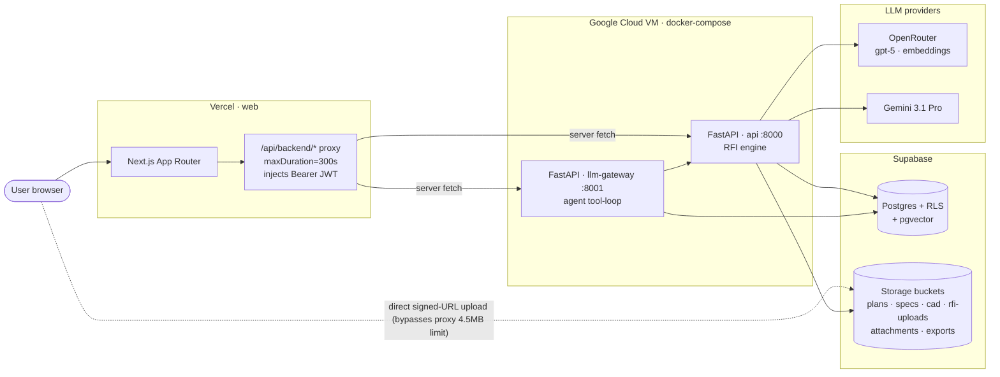

Key transport facts:

- The browser **never** calls FastAPI directly. Every call goes through the Next.js catch-all proxy `web/src/app/api/backend/[...path]/route.ts` → `web/src/lib/proxy-upstream.ts`, which injects the Supabase JWT as `Authorization: Bearer …` so FastAPI runs under that user's RLS. `maxDuration = 300` matches the VM's nginx ceiling so long vision analyses don't 504.
- Large file bytes bypass the proxy entirely: the client asks for a signed upload token (`…/upload-url`), PUTs straight to Supabase Storage, then calls `…/ingest`. This sidesteps Vercel's ~4.5 MB serverless body limit.
- Two endpoints stream Server-Sent Events: `POST /plans/ingest-stream` and `POST /cad/ingest-stream`. The proxy passes `upstream.body` unbuffered so SSE survives.

---

## 2. The three flagger pipelines

All three converge on a **per-flag table as the source of truth** (the `analysis` jsonb column on the parent upload row is a full mirror, kept for legacy readers and the overlay renderer).

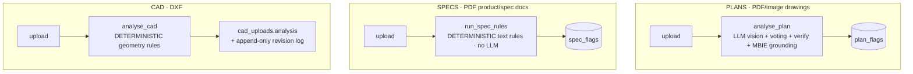

| Pipeline | Entry service | LLM? | Caching | Grounding | Per-flag table | Streams? |
|---|---|---|---|---|---|---|
| Plans | `services/plan_pipeline.py` | Yes (vision ×N + verify ×N + reconcile) | content-hash + prompt fingerprint | MBIE clauses | `plan_flags` | Yes (SSE) |
| Specs | `services/spec_pipeline.py` | No (deterministic) | none | none | `spec_flags` | No |
| CAD | `services/cad_pipeline.py` | No (deterministic geometry) | none | DXF entity handles | `cad_uploads.analysis` | Yes (SSE) |

The richest path is **Plans**, covered next. Specs and CAD are deterministic and comparatively simple.

---

## 3. Plan analysis pipeline (deep dive)

### 3.1 End-to-end flow

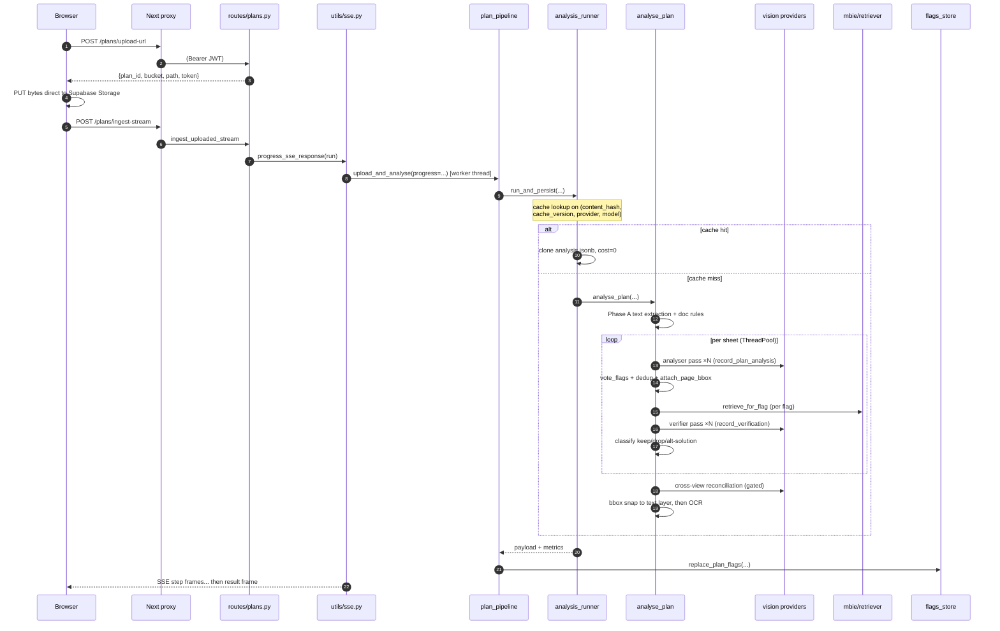

### 3.2 Phases inside `analyse_plan`

`analyse_plan(*, file_bytes, media_type, bca, project_type, project_description, risk_group="", importance_level="", progress=None) -> tuple[dict, str, Metrics, dict]` lives at `api/app/plans/analyzer.py:105`. `ANALYSIS_VERSION = "2.4.0"`.

| Phase | What happens | Code |
|---|---|---|
| **A** Text + rules | `extract_plan_text` pulls the PDF text layer; `run_doc_rules` produces deterministic `rule_flags`; the structured extraction is prepended to the prompt as JSON "ground truth" | `analyzer.py:148` |
| **Render** | `iter_sheets(pdf_bytes)` streams page-by-page → `RenderedSheet` at adaptive DPI (200 standard / 300 high-detail), tiling into 2×2 (10% overlap) when a page PNG exceeds 3.5 MB | `vision/core/renderer.py:132` |
| **B/C** Per-sheet vision + verify | `_run_sheets_parallel` runs sheets concurrently (`PLAN_SHEET_CONCURRENCY`, default 5). Per sheet: analyser pass ×N → vote → dedup → bbox → verifier pass ×N | `analyzer.py:416` |
| **B2/G/H** Cross-view | (gated by `plan_cross_view_enabled`) group related sheets into comparison sets, run one reconciliation LLM call per set, dedup two-citation flags. Optional cross-discipline coordination pass | `analyzer.py:297` |
| **D** Merge | `merged = attach_page_bbox(rule_flags) + verified_sheet_flags + cross_view_flags`, each tagged with discipline / sheet label | `analyzer.py:363` |
| **E** Text-layer snap | `refine_flag_bboxes` snaps each flag's bbox to the exact PDF text rect of its `verbatim_quote` (PyMuPDF, Levenshtein ≥ 0.85) → `bbox_source="text_layer"` | `plans/bbox_refiner.py:133` |
| **F** OCR fallback | `refine_via_ocr` runs RapidOCR on pages where the text layer missed (CAD-vectorised labels) → `bbox_source="ocr"` | `plans/ocr_refiner.py:146` |

### 3.3 The two (three) LLM calls

Every model call is a **forced single tool call** routed through `invoke_tool` (`api/app/vision/core/invoker.py:87`), which dispatches to OpenRouter or Gemini and **fails over once** to the other provider if `llm_provider_fallback` is set.

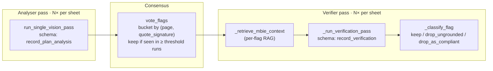

- **Analyser** — `run_single_vision_pass` (`api/app/vision/plans/vision_pass.py:32`), schema `ANALYSIS_TOOL_SCHEMA` (`record_plan_analysis`), prompt `plan_analyser_v2.md`. Each flag carries `page, area, category, severity (must_resolve|nice_to_have), confidence, verbatim_quote, reason, recommended_action` + optional `tile`/`bbox`. Runs `plan_analyser_voting_n` times (default 3) at temperature 0.
- **Voting** — `vote_flags(runs, threshold)` (`api/app/plans/vote.py:102`). Flags are bucketed by `vote_key = (page, "q:" + quote_signature)`; the verbatim quote is the *stable anchor* because the model relabels `area`/`category` between runs. A bucket survives if it appears in ≥ `threshold` distinct runs (default 2). `dedup_flags` then merges same-key duplicates keeping the highest confidence.
- **Verifier** — `verify_flags` (`api/app/vision/plans/vision_pass.py:216`), schema `VERIFICATION_TOOL_SCHEMA` (`record_verification`), prompt `plan_verification_v2.md`. First `_retrieve_mbie_context` fetches per-flag MBIE Acceptable-Solution clauses; then up to `plan_verifier_voting_n` verifier passes. **Dropping is fail-open**: a flag is dropped only when ≥ threshold of the passes that *returned a verdict* agree on a drop — a missing verdict, split vote, or total provider failure all *keep* the flag. `_classify_flag` (`vision_pass.py:100`) decides:
  - `drop_ungrounded` — verifier says the cited detail isn't actually visible.
  - `drop_as_compliant` — the detail matches an Acceptable Solution (requires *both* a quoted visible detail *and* a clause that was actually in the retrieved set — else the flag is kept).
  - `keep` — surviving flags carry `alt_solution_available` / `alt_solution_pathway` annotations and `mbie_clauses_considered` provenance.
- **Reconciliation** — `reconcile_set` (`api/app/plans/reconcile.py:120`), schema `RECONCILIATION_TOOL_SCHEMA` (`record_cross_view_discrepancies`), prompt `plan_reconciliation_v1.md`. One call per comparison set; produces two-citation cross-view flags (e.g. a level datum that disagrees between a plan and a section).

### 3.4 Cross-view reconciliation

To avoid an N² pairing of sheets, related views are grouped **deterministically** first.

- `build_view_record` (`api/app/plans/views.py:113`) builds a per-sheet `ViewRecord` (`view_type`, `discipline`, `level_id`, `scale`, `datums`, `callouts`) by merging the `view` objects emitted across the N analyser passes.
- `build_comparison_sets` (`api/app/plans/registration.py:65`) links sheets by **callout** edges (a section/detail marker whose `target_sheet` resolves to another sheet — strongest signal) and **level** edges (shared `level_id`), via union-find. A component is kept only if it has ≥2 datum-bearing views (or a callout link + ≥1 datum). Capped at `max_sets=12`, `max_set_size=5`.
- `build_coordination_sets` (`registration.py:166`) is the Phase-6 commercial path: same-level sheets of ≥2 *distinct disciplines* (does not require datum anchors — the comparison is visual). Gated by `plan_coordination_enabled` (default off).
- `reconcile_sets` (`reconcile.py:165`) fans out the reconciliation calls (concurrency 4); `dedup_cross_view` (`vote.py:86`) collapses order-independent duplicates.

### 3.5 Bounding-box lifecycle

A flag's `bbox` is progressively refined; `bbox_source` records provenance (`model` → `tile_fallback` → `text_layer` → `ocr`).

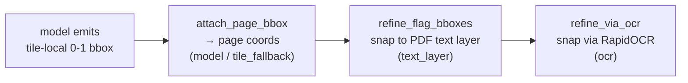

- `attach_page_bbox` (`api/app/plans/bbox.py:53`) — converts a tile-local box (each tile = a 0.5×0.5 page region) to page coordinates. Malformed → coarse `tile_region` fallback with `bbox_source="tile_fallback"`.
- `refine_flag_bboxes` (`api/app/plans/bbox_refiner.py:133`) — sliding-window Levenshtein match of the `verbatim_quote` against the cited page's words (≥ 0.85), disambiguating duplicate phrases by proximity to the model's hint box.
- `refine_via_ocr` (`api/app/plans/ocr_refiner.py:146`) — RapidOCR (PP-OCRv4 ONNX) at 300 DPI, only for flags not already snapped to `text_layer`; gated by `plan_ocr_refiner_enabled`.
- `compute_bbox_stats` (`api/app/plans/stats.py:12`) backs the `/plans/{id}/bbox-stats` diagnostic endpoint (grounded %, text-anchored %, mean/median area by source).

### 3.6 Caching & persistence

- **Cache key** = `(content_hash, cache_version(), provider, model_id)` against `plan_uploads` rows with `status="analysed"` (index `plan_uploads_cache_lookup_idx`). `cache_version()` (`plan_pipeline.py:46`) = `prompt_fingerprint(ANALYSIS_VERSION, (ACTIVE_ANALYSIS_PROMPT, ACTIVE_VERIFICATION_PROMPT))` — `prompt_fingerprint` (`analysis_runner.py:27`) folds a SHA-256 of the *prompt bodies* into the version, so editing a prompt invalidates the cache even without a version bump.
- **Cache hit** → `run_and_persist` (`analysis_runner.py:74`) clones the prior `analysis` jsonb into a new row at `cost_usd=0`; no LLM runs.
- **Persist** → the `plan_uploads` row is updated to `analysed` (analysis jsonb + prompt versions + `verification_drops` + `image_count` + `dpi_breakdown` + cost). Then `replace_plan_flags` (`api/app/plans/flags_store.py:60`) deletes prior `plan_flags` rows and bulk-inserts each merged flag (chunks of 500). **This runs for both fresh and cloned analyses**, so `plan_flags` is always in sync.

### 3.7 Spec & CAD pipelines (deterministic)

- **Specs** — `services/spec_pipeline.py:48`. PDF only. `extract_spec_text` → if `looks_scanned`, status `no_text_layer`; else `run_spec_rules` produces flags, status `analysed`. Writes `spec_documents` row + `replace_spec_flags` (`services/spec_flags_store.py:35`). No LLM, no cache-clone, no streaming.
- **CAD** — `services/cad_pipeline.py:32`. DXF only. `analyse_cad(dxf_bytes, bca, project_type, project_description)` runs deterministic geometry rules and grounds flags by **DXF entity handles** (not pixel bboxes — see `to_cad_schema` / `target_handles` in `vision/core/localization.py`). Adds an **append-only revision log**: `commit_ops` (optimistic lock via `check_base_is_latest`, raises `CommitConflict` → HTTP 409), `revert_to` (undo/redo), `recheck_revision` (background re-run of the compliance check storing a verdict on the revision row).

---

## 4. MBIE grounding subsystem

Two *distinct* grounding subsystems are easy to conflate:

| | Stage-A flag matching (`app/grounding/*`) | MBIE clause grounding (`app/mbie/*`) |
|---|---|---|
| Matches | RFI letter item → existing plan flag | analyser flag → MBIE Acceptable-Solution clause |
| When | letter pipeline, after extraction | inside the plan verifier, at analyse time |
| Method | deterministic token/clause Jaccard | hybrid pgvector + FTS retrieval |
| Corpus | none (the plan's own flags) | `mbie_clauses` table |

### 4.1 MBIE clause retrieval (flag → clause)

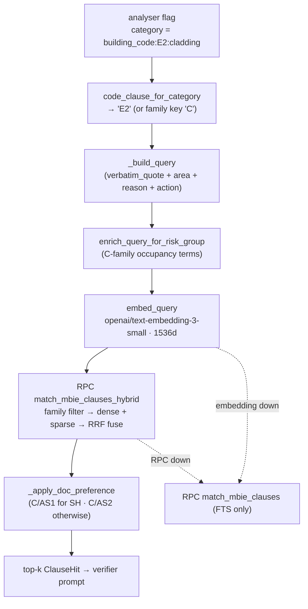

`retrieve_for_flag(db, *, flag, k=3, mode="hybrid", query_variant="full", risk_group=None)` (`api/app/mbie/retriever.py:168`) is the production entrypoint:

1. `code_clause_for_category(category)` maps `"building_code:E2:cladding" → "E2"`; returns `[]` for non-`building_code:` categories. A single-letter result (`C`, `F`) is a **family prefix** matched by the RPC (so the fire family `C` finds C/AS1, C/AS2, C/VM2).
2. Build the query from the flag's prose fields, strip `plainto_tsquery`-hostile punctuation.
3. Risk-group bias (`preferred_documents_for`): C/AS1 covers only Risk Group SH; everything else → C/AS2 (same split for F7/AS1 vs F7/AS2). `enrich_query_for_risk_group` appends purpose-group descriptor terms for C-family queries.
4. Embed the query (`api/app/llm/embeddings.py:95`); on any embedding failure pass `None` and degrade to sparse.
5. Call **`match_mbie_clauses_hybrid`** — family-filter → `dense` CTE (pgvector cosine `embedding <=> p_embedding`) + `sparse` CTE (Postgres `ts_rank`) → **Reciprocal Rank Fusion** `1/(rrf_k + rank)` (default `rrf_k=60`). RRF fuses on *rank*, so the two incomparable score scales never need normalising. On RPC failure, fall back to the FTS-only `match_mbie_clauses`.

Degradation chain (never breaks verification): **hybrid → embedding-down sparse → RPC-down FTS**.

> Critical FTS fix (`20260614000002_mbie_fts_or_semantics.sql`): both RPCs originally used `plainto_tsquery`, which ANDs every lexeme — since the flag query concatenates many tokens, a clause had to contain *all* of them (measured sparse recall@5 = 0.09). The fix swaps `' & '` → `' | '` (OR semantics) with a `nullif(...,'')` empty-query guard.

`format_hits_for_prompt` (`retriever.py:318`) renders the hits for the verifier; `hit_provenance` (`retriever.py:265`) is the compact audit record attached to every kept/dropped flag.

### 4.2 Alternative-Solution validation

The cheap verifier model writes a free-text `alt_solution_pathway` (how an AS deviation could still comply under Building Act s19(1)(b)). `unverified_citations(text)` (`api/app/mbie/pathway.py:50`) deterministically audits its clause citations against `VALID_CLAUSES` (the canonical NZBC Schedule-1 clause set A1–H1). `E2.3.2 → E2` passes; `E9.1 → E9` is flagged as fabricated. The UI uses this to mark a pathway "contains unverified references."

### 4.3 MBIE ingestion

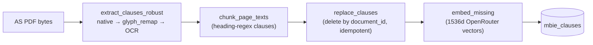

- `extract_clauses_robust` (`api/app/ingestion/mbie/extract.py:63`) — native-first, with fallbacks chosen only if they yield *more* clauses. Detects the C/AS1 obfuscated font via a private-use-area ratio (`_pua_ratio > 0.005`) and a zero-clause-despite-substantial-text guard.
- `glyph_remap.derive_pua_digit_map` (`api/app/ingestion/mbie/glyph_remap.py:179`) — losslessly recovers digit glyphs that C/AS1 maps into the Unicode private-use area, pooling votes from clause-number crops + isolated glyph crops, with bijection + completeness safety guards (returns `None` → caller falls back to OCR). Safe for a legal document.
- `page_texts_ocr` (`api/app/ingestion/mbie/ocr.py:99`) — RapidOCR full-page fallback.
- `replace_clauses` (`api/app/ingestion/mbie/persistence.py:42`) — delete-by-`document_id` + chunk insert (idempotent).
- `embed_missing` (`api/app/ingestion/mbie/backfill.py:124`) — populates 1536-d vectors for rows where `embedding is null`.
- `MbieAcceptableSolutionExtractor.extract` (`api/app/ingestion/extractors/mbie_acceptable_solution.py:206`) is the one place that writes *both* the verifier's `mbie_clauses` corpus *and* the value-engineering knowledge base from a single extraction pass. It persists clauses *first* (so the corpus updates even if the VE LLM pass times out) and applies the zero-clause guard before persisting.

### 4.4 LLM infrastructure

| File | Role |
|---|---|
| `api/app/vision/core/invoker.py` | `invoke_tool` — single forced-tool entry, OpenRouter↔Gemini fail-over; `analyser_provider_model` centralises tier resolution |
| `api/app/llm/openrouter.py` | `call_openrouter_tool` — OpenAI Chat Completions schema, forced tool call, native JSONSchema |
| `api/app/llm/gemini.py` | `call_gemini_tool` — Gemini function-calling, strips unsupported JSONSchema keys, `mode="ANY"` forced |
| `api/app/llm/embeddings.py` | `embed_texts` / `embed_query` — OpenRouter `/embeddings`, batched (128), truncated to 8000 chars |
| `api/app/llm/retry.py` | `call_with_retries` — exponential backoff + jitter, retries `{408,409,425,429,5xx}` + httpx timeouts; `TransientLLMError` |

---

## 5. The RFI letter pipeline

The inbound flow: a real council letter → canonical JSON → classify → ground → draft → export.

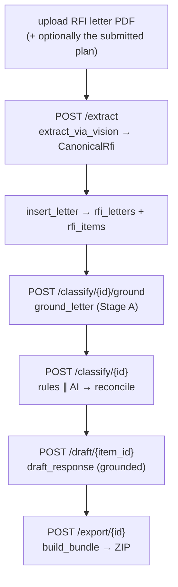

### 5.1 Extraction

`POST /extract` (`api/app/routes/extract.py:28`, ≤25 MB) → `extract_via_vision` (`api/app/vision/rfi/extractor.py:30`) renders pages and asks the vision model (schema `record_rfi_letter`, prompt `rfi_extract_v1.md`) to segment the letter into items. Each item runs through deterministic `extract_entities(text)` to pull clause codes, document references, standards, dimensions. The letter may be linked to a `plan_upload_id` *or* `cad_upload_id` (mutually exclusive). Persisted via `insert_letter` → `rfi_letters` + `rfi_items`, with an audit row in `rfi_extractions`.

### 5.2 Stage-A grounding (item → flag)

`ground_letter(db, letter_id)` (`api/app/grounding/runner.py:71`) loads the linked plan's `analysis.flags` and, per item, picks the single best-matching flag via `best_match` (`api/app/grounding/matcher.py:140`):

```
score = 0.6 · jaccard(clause_codes) + 0.4 · jaccard(content_tokens)
keep if score ≥ MATCH_THRESHOLD (0.35)
```

The result is upserted into `rfi_item_plan_evidence` (`source="flag"` with `flag_index` + denormalised `evidence`, or `source="none"`). This evidence is what lets the drafter say "located on the revised plan at …" instead of "needs your input." `evidence_payload` (`matcher.py:215`) captures matched clauses/tokens, overlaps, the proposed-change op, and location fields.

### 5.3 Two-pronged classification

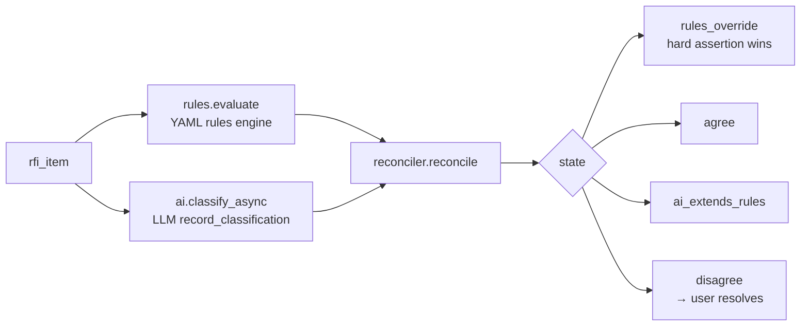

`_run_classify_letter` (`api/app/routes/classify.py:51`) runs the rules prong synchronously and gathers the AI prong concurrently (`asyncio.gather`), then `reconciler.reconcile` (`api/app/classifier/reconciler.py:29`) merges them into a `FinalClassification` with one of four states, persisted via `replace_letter_classifications` into `classifications` + `reconciliation_log`. Disagreements surface in the UI for the user to resolve (`POST /reconciliation/{log_id}/resolve`).

---

## 6. Risk, drafting, export

### 6.1 Pre-lodgement risk (`api/app/risk.py`)

`score_project(*, bca, project_type, description, addressed_corpus_ids, corpus)` (`risk.py:131`) scores a project's free-text description against the BCA-specific `bca_corpus`. Per corpus row: `+1.0` clause match (via `extract_entities`), `+0.6` high-precision keyword hit, `+0.3` weak token overlap — then × category weight. Aggregate = **mean of the top-5 scores**; bands `≥0.65` high / `≥0.30` medium / else low. Returns the top-15 likely RFI items. Exposed at `POST /risk/score`.

### 6.2 Response drafting (`api/app/drafter.py`)

`draft_response(...)` (`drafter.py:154`) fills `drafter_v2.md` and forces the `record_draft` tool. The Stage-A evidence is injected via `_render_plan_evidence_block` (`drafter.py:26`) in one of three shapes that steer the model without forking the template:

- **`NO MATCH`** — no evidence → "needs your input."
- **`VISION`** — vision lookup not yet wired → treated as NO MATCH.
- **`FLAG-MATCHED`** — matched clause, located-on-plan (DXF handles / page / quote), analyser rationale, and a "Proposed fix (already specified by the analyser)" line built from the `proposed_change` op. "Ground every claim in the above."

Cached by SHA-256 of `item_text | category | bca | project_type | version | evidence_source | evidence_flag_idx` — so a re-grounded item is re-drafted rather than returning a stale NO-MATCH draft. Drafts persist to `responses` (`POST /draft/{item_id}`), and `PATCH /draft/{item_id}` tracks the human `edit_distance`.

### 6.3 Export bundle (`api/app/exporter.py`)

`build_bundle(...)` (`exporter.py:244`) renders a ReportLab cover letter + per-item response PDFs + a `00_index.pdf`, named per the BCA's `taxonomy.json` filename convention, zipped (`POST /export/{letter_id}` → uploads to the `exports` bucket → signed URL, sets status `rfi-responded`). A parallel **deterministic** markdown covering-letter path exists at `api/app/grounding/render.py` (`render_covering_letter`, `GET /classify/{id}/render`), built purely from the persisted evidence rows.

---

## 7. HTTP API surface

Router prefixes are wired in `api/app/main.py:98`. Full path = prefix + decorator path. Auth on every data route via `get_db` (`api/app/auth.py:44`), which injects the caller JWT so Supabase RLS enforces ownership (non-owner → empty row → 404).

### Plans — `/plans` (`routes/plans.py`)

| Method + path | Handler | Notes |
|---|---|---|
| POST `/plans` | `upload_and_analyse` | multipart, 10/min |
| POST `/plans/upload-url` | `create_upload_url` | mints signed upload token |
| POST `/plans/ingest` | `ingest_uploaded` | analyse already-uploaded bytes |
| **POST `/plans/ingest-stream`** | `ingest_uploaded_stream` | **SSE** |
| GET `/plans/{id}` | `get_plan` | full row |
| GET `/plans/{id}/signed-url` | `get_plan_url` | |
| GET `/plans/{id}/pages` | `list_pages` | page geometry |
| GET `/plans/{id}/pages/{n}.png` | `page_image` | rendered page PNG |
| GET `/plans/{id}/bbox-stats` | `bbox_stats` | diagnostics |
| GET `/plans/{id}/overlay.pdf` | `overlay_pdf` | redlined PDF |
| POST/GET `/plans/{id}/value-engineering[/overlay.pdf]` | VE | |
| DELETE `/plans/{id}` | `delete_plan` | |

### Specs — `/specs` (`routes/specs.py`)
`POST /specs`, `POST /specs/upload-url`, `POST /specs/ingest`, `GET /specs/{id}`, `GET /specs/{id}/signed-url`, `DELETE /specs/{id}`. No streaming variant (deterministic, fast).

### CAD — `/cad` (`routes/cad.py`)
Upload/ingest (+ **`POST /cad/ingest-stream`** SSE), `GET /cad/{id}`, views + view PNGs, `POST /cad/{id}/revisions`, **interactive editor** (`GET /cad/{id}/scene`, `POST /cad/{id}/ops` → 409 on stale base + background recheck, `POST /cad/{id}/revert`, `GET /cad/{id}/revisions`), **RFI pins** (`GET/POST /cad/{id}/rfi-pins`, `PATCH/DELETE …/{pin_id}`), VE, delete.

### Letter pipeline
- `/extract` — `POST /extract` (upload + extract).
- `/letters` + `/items` — `GET /letters/{id}`, `GET /letters/{id}/signed-url`, `PATCH /items/{id}`.
- `/classify` + `/reconciliation` — `POST /classify/{id}`, `POST /classify/{id}/full` (ground→classify→draft), `POST /classify/{id}/ground`, `GET /classify/{id}/render`, `GET /classify/{id}`, `POST /classify/rules-only`, `POST /reconciliation/{log_id}/resolve`.
- `/draft` — `POST/GET/PATCH /draft/{item_id}`.
- `/attachments` — `POST /attachments/items/{item_id}`, `DELETE /attachments/{id}`.
- `/export` — `POST /export/{letter_id}`.
- `/risk` — `POST /risk/score`.
- `/api/forecast`, `/api/forecast/summary`, `/api/resolve-documents`, `/health`.

Storage buckets (`api/app/storage.py`): `rfi-uploads`, `attachments`, `exports`, `plans`, `cad`, `specs`. Path convention `{project_id}/{entity_id}/{filename}`.

---

## 8. SSE streaming + frontend

### 8.1 The streaming bridge

`progress_sse_response(run, *, error_label)` (`api/app/utils/sse.py:35`) bridges a **synchronous** blocking pipeline (run on a worker thread via `asyncio.to_thread`) onto an asyncio queue. The thread-safe `progress(event)` callback hops events back to the loop with `loop.call_soon_threadsafe`. Frames:

- `step` — one per progress call: `{id, label, status: "running"|"done", detail}`.
- `result` — one on success (the pipeline's result payload).
- `error` — on failure; only `error_label` is emitted, never the raw exception.

Wire format quirk: `media_type="text/plain"` (not `text/event-stream`) to dodge Safari chunk-dropping, plus `X-Accel-Buffering: no` to defeat nginx buffering. The analyser emits progress at every phase; step ids come from atomic `itertools.count` (positive for the analyser, negative for the pipeline wrapper so they never collide).

### 8.2 Frontend consumption

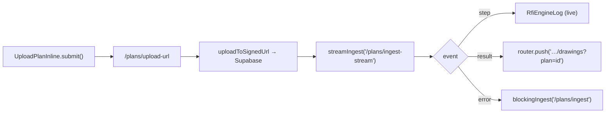

- `streamIngest(endpoint, body, signal?)` (`web/src/lib/ingest-stream.ts:40`) — async generator. POSTs with `Accept: text/plain`, reads `res.body.pipeThrough(TextDecoderStream)`, splits frames on `\n\n` or `\r\n\r\n`, yields `IngestEvent`s. Has a Safari fallback that re-reads a cloned response in full if zero frames streamed. Throws `RFI engine unavailable` if the stream never opens (caller falls back to the blocking endpoint).
- `RfiEngineLog({steps, title, hint, done})` (`web/src/components/rfi-engine-log.tsx:8`) — pure presentational live log: each `step` shows a spinner while `running`, a green check when `done`. All state lives in the parent.
- `UploadPlanInline` (`web/src/app/plans/upload-plan-inline.tsx:27`) — the primary driver. `analyseRfi=false` stores the file without running the flagger (used by the VE page). Maintains `Map<id, IngestStep>` and re-renders `RfiEngineLog` live.

### 8.3 Frontend surface map

| Surface | File | Role |
|---|---|---|
| Drawings hub | `web/src/app/projects/[id]/drawings/page.tsx` | upload drawings + specs, list docs, render selected review |
| Upload (drawing) | `upload-plan-inline.tsx` / `upload-drawing-panel.tsx` | streaming upload + live log |
| Upload (spec) | `upload-spec-inline.tsx` | deterministic, blocking |
| Upload (RFI letter) | `upload-rfi-inline.tsx` | extract → ground pipeline (staged labels) |
| Spec review | `spec-review.tsx` | read-only flag list |
| CAD review | `cad-review.tsx` | overlay pins + apply auto-fixes + editor |
| VE review | `value-engineering-review.tsx` | cost-reduction opportunities |
| RFI hub | `projects/[id]/rfis/page.tsx` | letters list + inline review |
| Letter review | `projects/[id]/rfi/[letterId]/letter-review.tsx` | classify / ground / draft / attach / export |
| CCC readiness | `web/src/lib/ccc.ts` | (peripheral) consent-completion checklist |

---

## 9. Data model

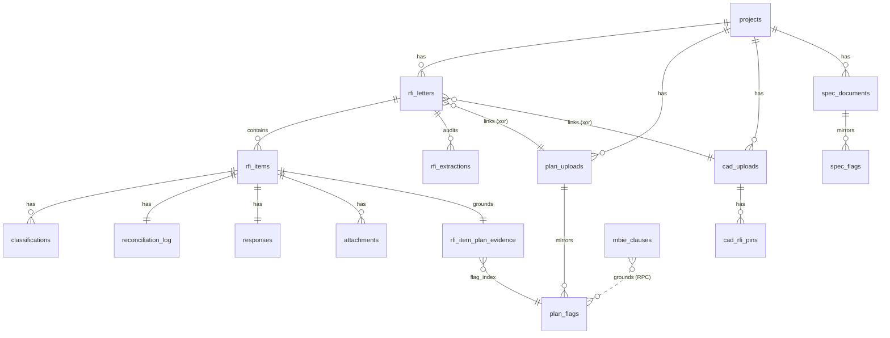

Highlights (full column lists in the migrations under `supabase/migrations/`):

- **`projects`** — root entity; `user_id` is the RLS ownership anchor (resolved by `user_owns_project()`).
- **`plan_uploads`** — PDF + analysis. `analysis jsonb` is the full flag mirror; cache columns `content_hash, analyser_version, prompt_version, provider, model_id` back `plan_uploads_cache_lookup_idx (… WHERE status='analysed')`.
- **`plan_flags`** (`20260607000001`) — per-flag source of truth. `bbox_source`, `verified`, `pass_index`, plus `alt_solution_available` / `alt_solution_pathway` (`20260612000002`). Indexed by upload+sheet, project, severity, discipline.
- **`spec_documents`** / **`spec_flags`** (`20260620000004`) — mirror of the plan tables for specs; created *after* the multi-user flip so they only ever had owner-scoped RLS.
- **`rfi_letters`** — `canonical_json`, `rendered_markdown`, plus `plan_upload_id` / `cad_upload_id` with CHECK `rfi_letters_one_plan_link` (at most one). `rfi_items`, `rfi_extractions` (+ `prompt_version` from `20260611000001`).
- **`rfi_item_plan_evidence`** (`20260603000001`) — one row per item, `source ∈ {flag,vision,none}`, `flag_index`, denormalised `evidence`, `confidence`, `matcher_version`.
- **`classifications`** / **`reconciliation_log`** — two-pronged trail; `responses` (with `edit_distance`); `attachments`.
- **`cad_rfi_pins`** (`20260614000001`) — human-authored review pins (`bbox`, `handle`, `clause`, `comment`, `status`).
- **`mbie_clauses`** (`20260610000001`) — clause corpus. `fts tsvector` (GIN index, trigger-maintained) + `embedding vector(1536)` (`20260613000003`). No ANN index — ~2k clauses, family-prefiltered to a few hundred rows → sub-ms exact scan.
  - RPC `match_mbie_clauses(p_code_clause, p_query, p_limit)` (`20260613000002`) — family-prefix FTS (single letter → `LIKE 'X%'`).
  - RPC `match_mbie_clauses_hybrid(p_code_clause, p_query, p_embedding, p_limit, p_rrf_k)` (`20260613000003`) — dense + sparse + RRF.
- **RLS** (`20260620000001`) — strict per-user isolation: drops all leftover `allow_all_single_user` policies, owner-scoped `*_owner_all` policies via `user_owns_project(project_id)`; shared corpora (`mbie_clauses`, VE tables) are authenticated-read + service-role-write (ingestion bypasses RLS as service_role).

---

## 10. LLM-gateway agent tools

The `llm-gateway` (`:8001`) hosts the **ARRO Project Copilot** — a tool-use loop (`agent_loop.run_agent`, `MAX_TOOL_ITERATIONS = 5`) over the RFI engine. Tools split into API-wrappers and direct-Supabase reads.

| Tool | Kind | Calls | Purpose |
|---|---|---|---|
| `classify_rfi_letter` | API | `POST /classify/{id}` | run two-pronged classification on a letter |
| `draft_rfi_response` | API | `POST /draft/{item_id}` | draft one item (must be classified → else 409) |
| `get_rfi_letter` | API | `GET /letters/{id}` | fetch letter + items |
| `score_project_risk` | API | `POST /risk/score` | pre-lodgement risk from description |
| `get_plan_flag` | Supabase | `plan_flags` by id | one full flag row |
| `get_plan_flags` | Supabase | `plan_uploads`/`cad_uploads.analysis` | full flag list (`MAX_INLINE_FLAGS=200` guard) |
| `list_plan_flags` | Supabase | `plan_flags` paginated | filtered/paged escape hatch (severity, discipline, sheet range, category prefix) |
| `get_project_workflow` | Supabase | aggregates 4 domains | RFIs + attachments + plans + inspections summary |

`api_client.api_request` (`llm-gateway/app/tools/api_client.py`) forwards the caller's bearer token from a contextvar so gateway tools hit FastAPI under the same RLS. `prompts/system.py` ships a cacheable static prompt (tool-selection guidance, "never invent flag counts/dates," no em-dashes) + a per-request dynamic block (`project_id`/`tab`/`route`).

---

## 11. Knowledge corpus

`shared/research/` holds the grounding data. Raw council/MBIE PDFs feed `api/app/ingestion/` extractors; the live ingest URLs are in `api/app/ingestion/scraping/sources.yaml`.

- `christchurch-city-council.md`, `selwyn-district-council.md`, `waimakariri-district-council.md` — council process summaries.
- `ccc-raw/`, `selwyn-raw/`, `wdc-raw/` — raw council consent-process docs (forms, checklists, the 20-day clock, PS1–PS4).
- `mbie-raw/` — MBIE determinations + performance reports; source PDFs for `mbie_clauses` ingestion.
- `building_plans/` — sample plans + a synthetic-plan generator (vision-pipeline fixtures).
- `synthetic-rfis/` — the classifier/drafter bootstrap corpus: `taxonomy.json` (unified RFI taxonomy keyed to code clauses), `ccc/sdc/wdc.jsonl` (28 synthetic RFIs each, council-voice), `determinations.jsonl` (3 real verbatim excerpts), `mbie-stats.json` (national + council RFI rates → risk/forecast models).

The prompt files live separately in `api/prompts/`: `plan_analyser_v2.md`, `plan_verification_v2.md`, `plan_reconciliation_v1.md`, `plan_coordination_v1.md`, `plan_view_addendum.md`, `rfi_extract_v1.md`, `classifier_v1.md`, `drafter_v2.md`, `cad_analyser_v1.md`, plus VE prompts. Each carries a frontmatter `version`, loaded by `vision/core/prompts.py:load_prompt`.

---

## 12. Configuration reference

From `api/app/config.py` (`Settings`, env via `.env`/`.env.local`). Knobs that change engine behaviour:

| Setting | Default | Effect |
|---|---|---|
| `plan_analyser_provider` / `plan_verifier_provider` | — | which LLM tier runs each pass |
| `plan_analyser_voting_n` / `_threshold` | 3 / 2 | analyser self-consistency voting |
| `plan_verifier_voting_n` / `_threshold` | 1 / 2 | verifier fail-open dropping |
| `plan_cross_view_enabled` | true | Phase B2/G/H reconciliation |
| `plan_coordination_enabled` | false | cross-discipline coordination pass |
| `plan_ocr_refiner_enabled` | true | Phase F OCR bbox snap |
| `PLAN_SHEET_CONCURRENCY` (env) | 5 | per-sheet thread pool size |
| `llm_provider_fallback` | true | OpenRouter↔Gemini fail-over in `invoke_tool` |
| `llm_max_attempts` | 3 | retry budget per provider call |
| `rfi_max_pages` | 50 | letter page-count guard |
| `cad_analyser_provider` / `_model` | openrouter | CAD geometry analyser |
| `embedding_dim` | 1536 | must match `mbie_clauses.embedding` |

`cache_version()` folds `ANALYSIS_VERSION` ("2.4.0") + the analyser/verifier prompt bodies into the cache key, so editing a prompt invalidates cached analyses automatically.

---

## 13. File index

### API — plan pipeline
- `api/app/services/analysis_runner.py` — cache + persist scaffolding (`run_and_persist`, `prompt_fingerprint`).
- `api/app/services/plan_pipeline.py` — plan upload/analyse orchestration (`upload_and_analyse`, `cache_version`).
- `api/app/services/spec_pipeline.py` — deterministic spec pipeline.
- `api/app/services/cad_pipeline.py` — DXF pipeline + revision log.
- `api/app/plans/analyzer.py` — `analyse_plan` (phases A–H), `_run_sheets_parallel`.
- `api/app/plans/{vote,reconcile,registration,views}.py` — voting, cross-view reconciliation + set building.
- `api/app/plans/{bbox,bbox_refiner,ocr_refiner,overlay,stats}.py` — bbox lifecycle + rendering.
- `api/app/plans/{flags_store,prompt}.py` — `replace_plan_flags`, taxonomy block.

### API — vision
- `api/app/vision/plans/{vision_pass,schema}.py` — analyser + verifier calls, tool schemas.
- `api/app/vision/rfi/{extractor,schema}.py` — RFI-letter extractor.
- `api/app/vision/core/{invoker,renderer,prompts,localization}.py` — provider dispatch, PDF→PNG, prompt loader, shared localisation schemas.

### API — grounding / MBIE / risk / drafting
- `api/app/grounding/{matcher,runner,render}.py` — Stage-A flag matching + deterministic render.
- `api/app/mbie/{retriever,pathway}.py` + `mbie/eval/*` — clause retrieval, AS validation, eval harness.
- `api/app/ingestion/mbie/{extract,chunker,glyph_remap,ocr,persistence,backfill}.py` — MBIE ingestion.
- `api/app/ingestion/extractors/mbie_acceptable_solution.py` — the dual-write extractor.
- `api/app/{risk,drafter,exporter}.py` — risk scoring, drafting, export bundle.
- `api/app/llm/{openrouter,gemini,embeddings,retry}.py` — provider wrappers + retry.

### API — routes / infra
- `api/app/main.py` — router wiring.
- `api/app/routes/{plans,specs,cad,extract,letters,classify,drafts,attachments,export,risk,documents,forecasting,health}.py`.
- `api/app/{persistence,models,storage,config,auth}.py` + `api/app/utils/sse.py`.
- `api/app/classifier/{rules,ai,reconciler}.py` — RFI letter classification.

### Frontend
- `web/src/lib/{ingest-stream,api,proxy-upstream,ccc}.ts`.
- `web/src/app/api/backend/[...path]/route.ts` — the proxy.
- `web/src/components/rfi-engine-log.tsx`.
- `web/src/app/plans/{upload-plan-inline,upload-drawing-panel,upload-spec-inline,upload-rfi-inline,spec-review,cad-review,value-engineering-review}.tsx`.
- `web/src/app/projects/[id]/{drawings/page,rfis/page,rfi/[letterId]/{page,letter-review,types}}.tsx`.

### Gateway / data / corpus
- `llm-gateway/app/{agent_loop,prompts/system}.py` + `llm-gateway/app/tools/*.py`.
- `supabase/migrations/*.sql` (see §9).
- `shared/research/*` + `api/prompts/*.md`.
